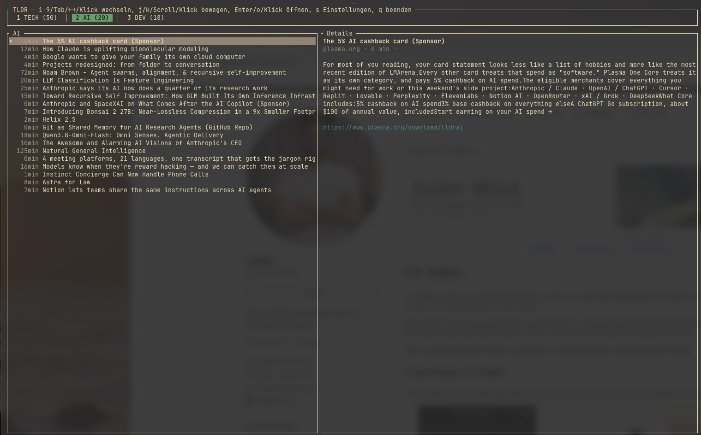

# tldr-glance

[](LICENSE)
[](https://www.rust-lang.org)
[](#platform)

A fast terminal UI for daily-scanning the [TLDR](https://tldr.tech) newsletters.



> [!NOTE]
> Runs on macOS and Linux/Unix. Developed and used day-to-day on macOS only — the Linux path
> (browser detection via `$PATH`, opening via `xdg-open`) is new and hasn't been verified on an
> actual Linux machine yet. See [Platform](#platform) for details.

## Why

tldr.tech recently got a new, minimalist redesign: article summaries are no longer shown directly,
they only load after you click a row. That costs noticeable time when scanning several issues a
day. `tldr-glance` fetches the issues straight from the terminal instead, shows every article with
its summary immediately, and is fully keyboard-driven.

Clipping interesting articles stays deliberately manual, via your usual browser web clipper —
`tldr-glance` only opens the article in your browser on request; it doesn't extract article content
itself. An attempt to automate that showed that programmatic extraction (linked sources, embedded
images, exact quotes) noticeably loses quality compared to a real web clipper.

## Installation

Requires a local Rust toolchain ([rustup.rs](https://rustup.rs)).

```sh
git clone https://github.com/maldaror/tldr-glance.git
cd tldr-glance
cargo build --release
./target/release/tldr-glance
```

Or run directly via Cargo:

```sh
cargo run -- [options]
```

## Usage

| Key | Action |
|---|---|
| `1`–`9` | Jump directly to edition (tab) N |
| `Tab` / `→` / `l` | Next edition |
| `Shift+Tab` / `←` / `h` | Previous edition |
| `j` / `↓` | Next article |
| `k` / `↑` | Previous article |
| `g` / `Home` | Jump to first article |
| `G` / `End` | Jump to last article |
| `Enter` / `o` | Open the selected article in the configured browser (system default unless set otherwise) |
| `s` | Open settings (editions and browser) |
| `q` / `Esc` | Quit (or leave settings without saving) |

### Settings

`s` opens the settings dialog. At the top, `←`/`→` (or `h`/`l`) picks the browser used to open
articles (system default, Safari, Google Chrome, Firefox, Microsoft Edge, Brave Browser, ...).
Below it is the list of all available TLDR editions (`tech`, `ai`, `dev`, `infosec`, `devops`,
`data`, ...): `j`/`k` moves the cursor, `Space` toggles an edition on/off. `Enter` applies both
selections, reloads the editions immediately, and saves everything persistently; `Esc` discards
the change.

## Configuration

The editions and browser last chosen in settings are stored at:

```
~/.config/tldr-glance/config.toml
```

(A config from before the `~/.config` move, at `~/Library/Application
Support/tldr-glance/config.toml`, is picked up and migrated automatically on first start.)

```toml
editions = ["tech", "ai", "dev"]
browser = "Google Chrome"  # omitted or null = system default
```

The file can also be edited by hand. All valid slugs are listed at
[tldr.tech/newsletters](https://tldr.tech/newsletters).

## CLI options

```
tldr-glance [OPTIONS]

-e, --editions <LIST>    Comma-separated editions for this run, overrides the
                          saved selection (e.g. "tech,ai,devops")
-d, --date <YYYY-MM-DD>   Issue date, defaults to today
    --max-back <N>        How many days to step back if no issue exists for the
                          date (default: 5)
    --dump                Print the parsed articles to stdout instead of starting the TUI
```

`--dump` is useful for debugging or a quick `grep` without the TUI:

```sh
cargo run -- --editions tech,ai --dump | grep -i azure
```

## How it works

tldr.tech is currently mid-migration between two different templates, served depending on
edition/date:

- **New "keyboard feed" design** (currently e.g. `tech`): the actual article data (title, summary,
  category, read time) isn't visible in the HTML but embedded as JSON in a Next.js hydration
  script (`self.__next_f.push(...)`). `tldr-glance` finds the `"stories"` array in those chunks and
  parses it directly.
- **Old, server-rendered template** (currently e.g. `ai`, `dev`): articles are plain HTML in the
  DOM (`<section><header><h3>Section</h3></header><article>...</article>`), including real links
  and descriptions. This is parsed the classic way, via the DOM.

`tldr-glance` tries both strategies automatically and uses whichever fits the page.

Since tldr.tech still returns `HTTP 200` with a client-side "not found" page for a date that hasn't
been published yet (no real 404), the fetcher steps backward day by day as needed until it finds an
issue with actual articles.

## Platform

Fetching, parsing, the TUI, and the config path (`~/.config/tldr-glance/config.toml`) are
platform-neutral and run on both macOS and Linux/Unix. Only opening articles in the browser is
implemented differently per platform:

- **macOS**: browser detection looks for `.app` bundles in `/Applications`,
  `/System/Applications`, and `~/Applications`; opening goes through `open` or `open -a <Browser>`.
- **Linux/Unix**: browser detection looks for known binary names (e.g. `firefox`,
  `google-chrome-stable`, `brave-browser`) in `$PATH`; opening calls the found binary directly.
  Without a configured or found browser it falls back to `xdg-open` — that requires a desktop
  environment or `xdg-utils`. Safari and Arc aren't selectable, since there's no Linux version.
- Windows isn't supported.

Development and daily use happen exclusively on macOS; the Linux path is new and hasn't been
verified on an actual Linux machine yet. Feedback and contributions on that front are welcome.

## Known limitations

- Category coloring in the article list only recognizes the new template's tags
  (`launch`/`practical`/`event`/`opinion`); section names from the old template are shown in gray.
- No full-text search/filtering within an edition (not needed so far given the manageable number
  of articles per day).
- Linux support is new and untested (see [Platform](#platform)).

## License

[MIT](LICENSE)
